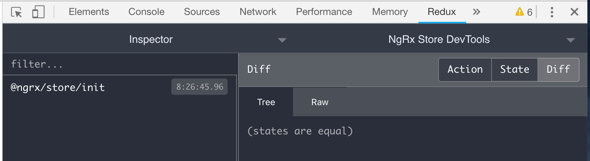
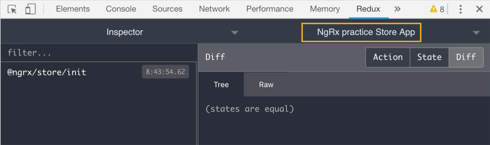

## setup ngrx
```
npm install @ngrx/{store,effects,entity,store-devtools} --save

ng config cli.defaultCollection @ngrx/schematics
ng generate store AppState --root --module app.module.ts 
or
ng generate @ngrx/schematics:store AppState --root --module app.module.ts
```
> The @ngrx/schematics command prefix is only needed when the default collection isn't set.
app.module.ts
```ts
import { StoreModule } from '@ngrx/store';
import { reducers, metaReducers } from './reducers';
import { StoreDevtoolsModule } from '@ngrx/store-devtools';
import { environment } from '../environments/environment';

@NgModule({
  imports: [
    StoreModule.forRoot(reducers, { metaReducers }),
    !environment.production ? StoreDevtoolsModule.instrument() : []
  ]
})
export class AppModule { }
```
/app/reducers/index.ts
```ts
import {
  ActionReducer,
  ActionReducerMap,
  createFeatureSelector,
  createSelector,
  MetaReducer
} from '@ngrx/store';
import { environment } from '../../environments/environment';

export interface AppState {

}

export const reducers: ActionReducerMap<AppState> = {

};

export const metaReducers: MetaReducer<AppState>[] = !environment.production ? [] : [];

```

> rename redux tool title
```ts
StoreModule.forRoot(reducers, { metaReducers }),
    !environment.production ? StoreDevtoolsModule.instrument({
      name: 'NgRx practice Store App',
      logOnly: environment.production,
    }) : []
```


## Define action
```
ng generate action auth/Auth
```
auth/auth.actions.ts
```ts
import { Action } from '@ngrx/store';
import { User } from '../models/user';

export enum AuthActionTypes {
  LoginAction = '[Login] Action',
  LogoutAction = '[Logout] Action'
}

export class Login implements Action {
  readonly type = AuthActionTypes.LoginAction;
  constructor(public payload: { user: User }) {}
}

export class Logout implements Action {
  readonly type = AuthActionTypes.LogoutAction;
}

export type AuthActions = Login | Logout;
```
## Define reducer
```
ng generate reducer Auth --flat=false --module auth/auth.module.ts
```
