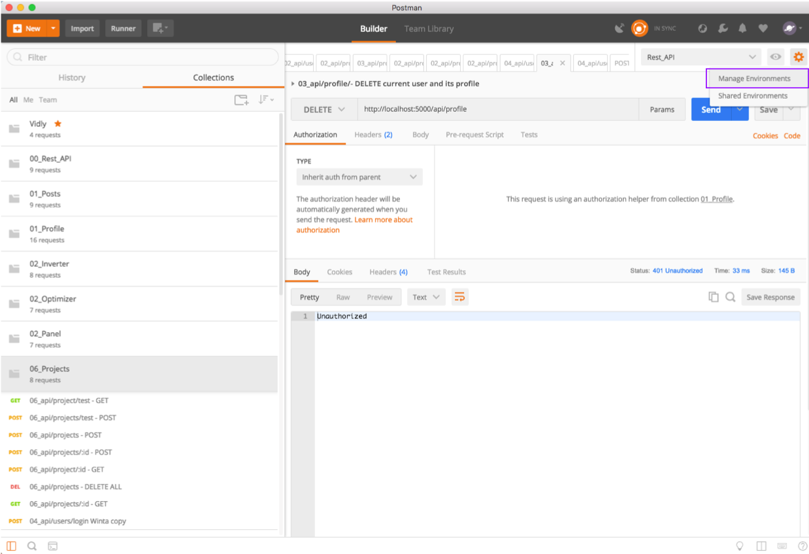
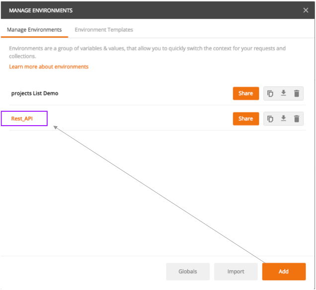
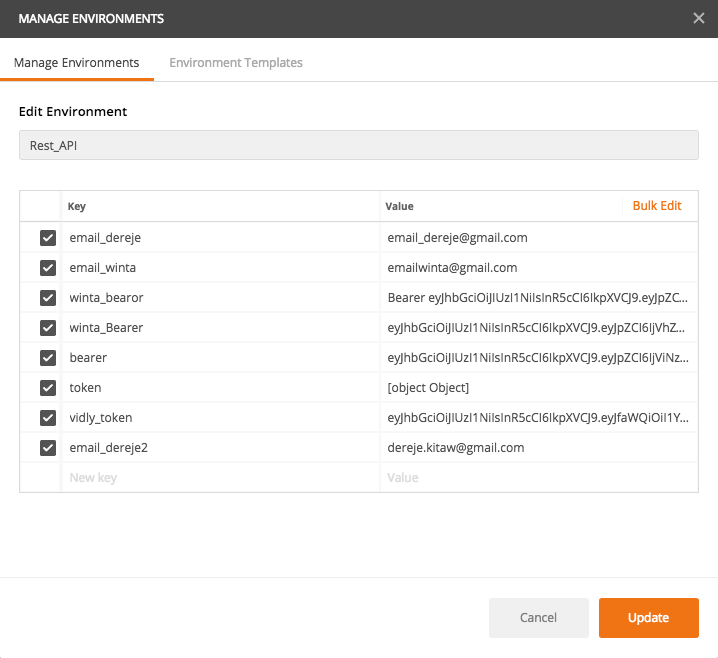
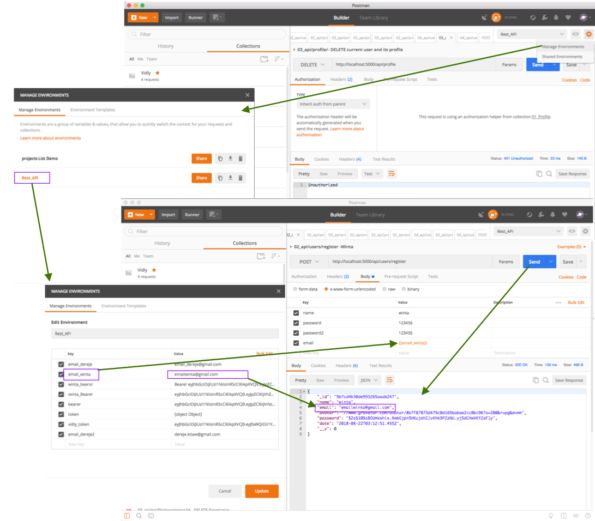
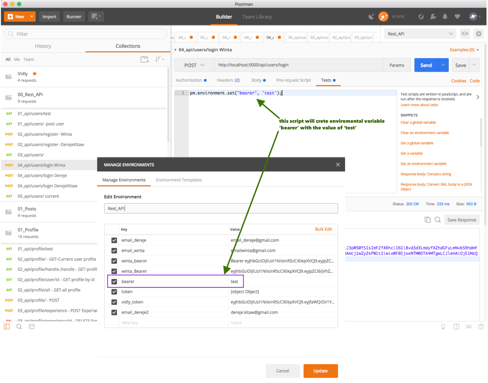
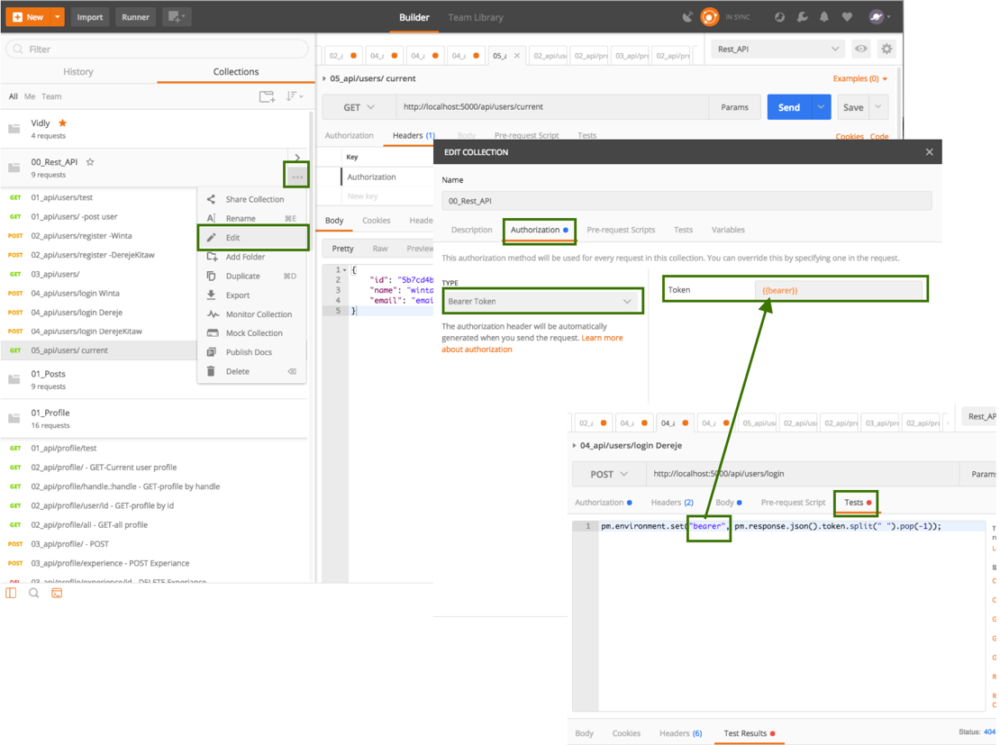

# How to use enviroment variable in postman

# How to save bearer token in environmental variable for future use.

pm.environment.set("bearer", test);

pm.environment.set("bearer", pm.response.json().token.split(" ").pop(-1));

# Using saved bearer in a collection

